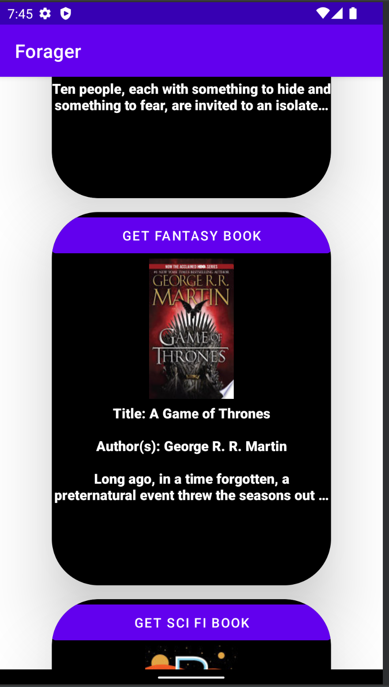
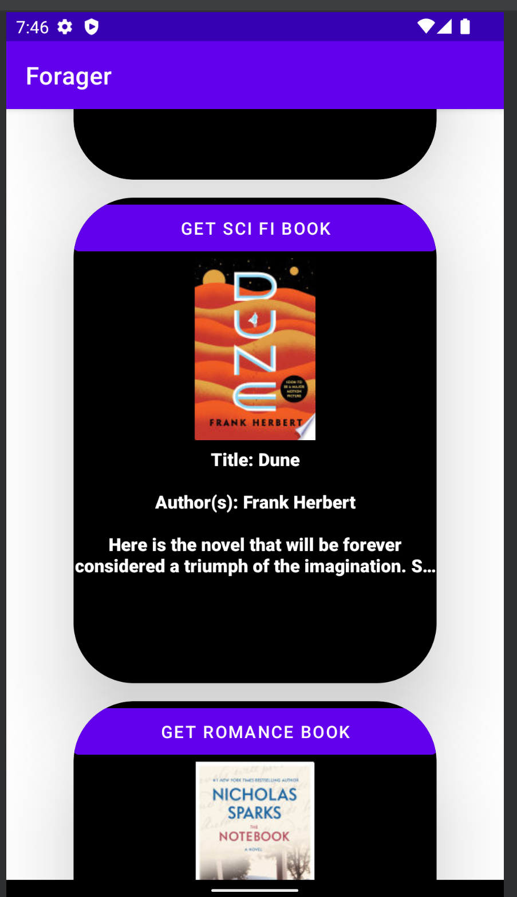
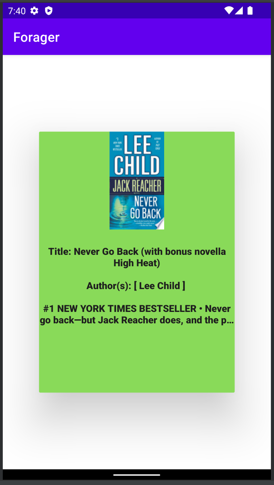

#forager
Forager is an Android application that calls the Google Books Api to search for any book that google has access to.

This is the front page.

If we would like to change one of the books displayed on the front page:
Let's click the Get Romance Book button. Our response would be this.

When searching for a book, entire your query in to the input field then click the search button. Let's say we would like to find the book Never Go Back. The app returns:

